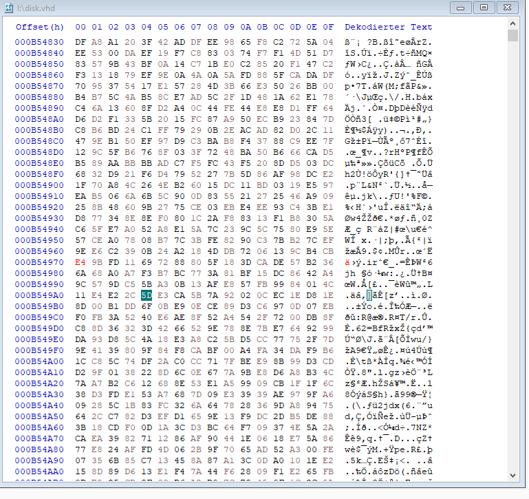
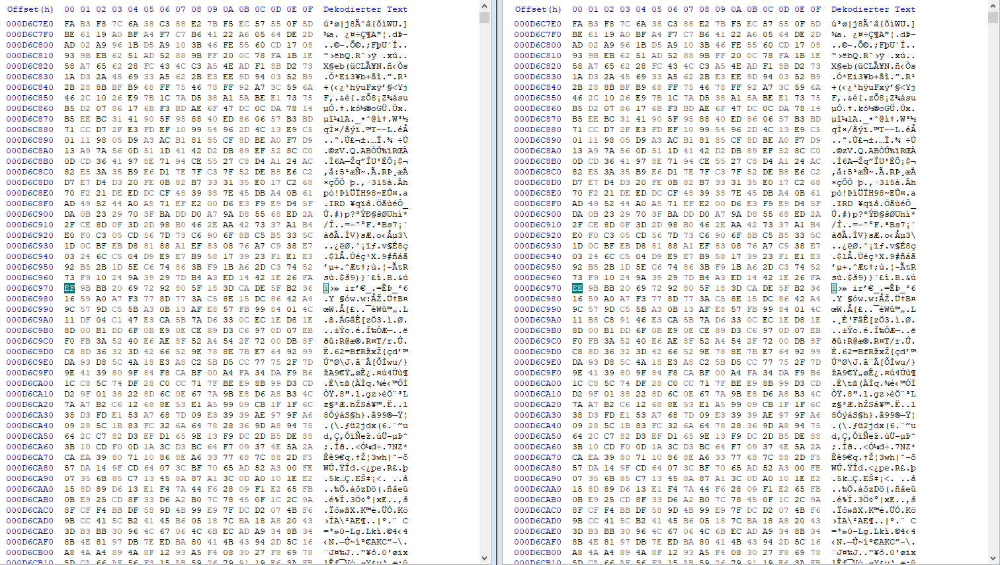
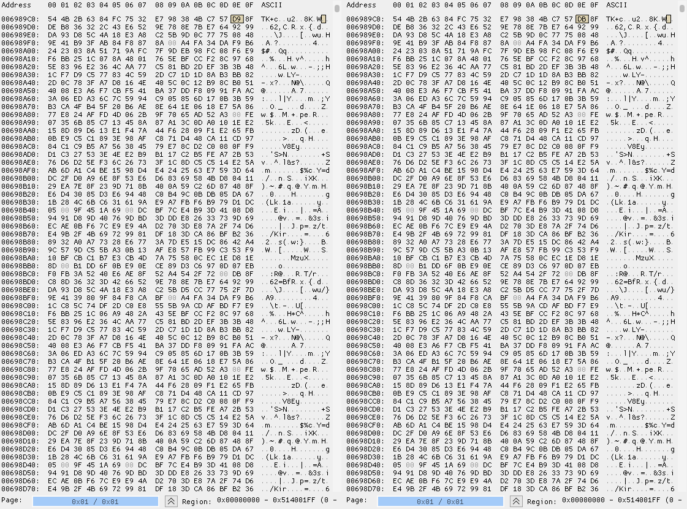
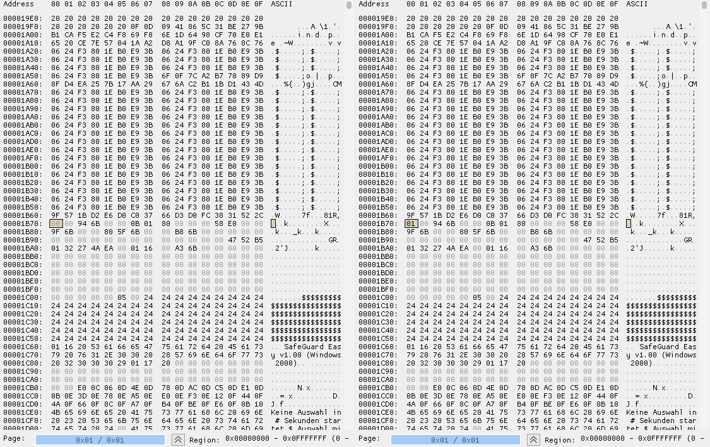
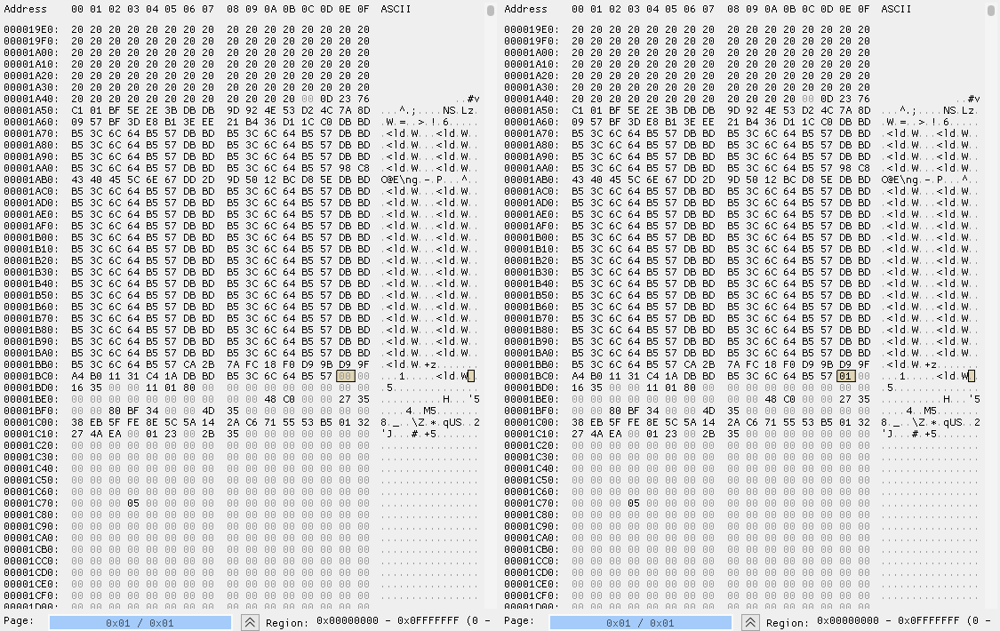

# About this Project
Ultimaco Safeguard was a earlys 2000s Harddrive encryption tool to fully encrypt Harddrives on bootup. This Project shall be a Knowledgebase for everyone who is intrested to gain back access to their data. 
Since SafeGuard is still a ongoing Project from Sophos this project will soley focus on the early adaptations from Ultimaco (Version 1.x to 4.x)

it is important to say that i am no Encryption researcher nor have any deep indepth knowledge on how those encryptions work out, thats why this project exists for others to add to what i have found out so far.

# Software requirements
In order to follow what i have done and reproduce it i reccomend certain softwares:

[VMWARE Workstation Pro](https://www.vmware.com/products/workstation-pro.html)
While i own the full version, the trail should be enough already.

[IMHex](https://github.com/WerWolv/ImHex)
Very good Hex editor

[Disk2VHD](https://learn.microsoft.com/en-us/sysinternals/downloads/disk2vhd)
If you want to make a copy of oyur encrypted Real Harddrive to use in the Virtual machine

# The Documentation
The most important part of understanding how SafeGuard works is a pdf i found on the Internet (**SafeGuard Easy Evaluation Documentation**) describing the internal way how SGE works and is most likley the number 1 Resource for anyone who wants to reverseengineer this:
[Link](https://www.commoncriteriaportal.org/files/epfiles/0176b.pdf)

## About SafeGuards Encryptions algorythms
Following passages where taken out of the  SafeGuard Easy Evaluation Documentation:

**SafeGuard Easy for Windows 2000, Version 1.0** 
6.1.1.1
The TSF shall generate cryptographic keys in accordance with a specified cryptographic key
generation algorithm Random Key Generator (defined in SafeGuard Easy for Windows 2000:
Informal Functional Specification and Correspondence Demonstration, Utimaco, 2001) and
specified cryptographic key sizes 64 bits (56 bits within used by DES) and 128 bits (used by
IDEA) that meet the following: no defined standards.
6.1.1.4
The TSF shall perform symmetric data encryption and decryption of user data on the hard
disk in accordance with a specified cryptographic algorithm IDEA and cryptographic key
sizes 128 bits that meet the following: IDEA standard as published by ASCOM Inc..

This means that if you encounter Safeguard 1.x your computer most likely is Encrypted by DES or IDEA (unknown encryption to me)
Alternativley there was also Blowfish, Stealth, XOR  available.

**Safeguard Easy 4**
While all the old Algorathms where sitll available to choose from. SGE 4.x by default selected AES 256 as default encryption. So its very likley your Harddrive is encrypted with this.

# Step 1 - Reverting back the Brueforce time
SGE introduces since version 1.x a waiting time that gets longer each time you fail to provide a correct password on bootup. This time increased by double each time you enter it wrong and will get saved back to the harddisk ultimativley rendering you incapable to reenter a password. But Safeguard has to write this failed attempt to the harddrive wich where we can jump in and revert the timer.
It is HIGHLY recommend to make a backup of your virtual Harddrive before you  try this!

## Finding the correct spot
If you are in the lucky position that safeguard (even after hours) askes you to enter a password then all you have todo is to put in 
the VHD file in oyur Virtual machine, boot it up and wait. As soon as you are on the spot of where you need to enter the Password make a Snapshot wich provides a memory clone where you can revert back instantly to the Password request.

Make sure you have a backup of your VHD file and enter a wrong password. Then Shutdown the machine and load up the two VHD files in your Hex editor. Make a Diff or Compare action on them and look for differences.

**Safeguard 1.x example** (red marked bit)

**Safeguard 3.5 example**

**Safeguard 4.11 example**

You will come across a single changed bit like shown here. 

**Safeguard Easy 1.0 - 3.5**
It starts at E4 (no failed attempt) and then counts up to E5 E6 E7...FF and so on. So change whatever value there is back to E4 and Save. Now the password token request should pop up immediatley in your virtual machine.
From here on you can use the Snapshot function from VMware to make a memory snapshot you can revert to so you keep preventing this counter to go up again.

**Safeguard Easy 4.11**
The bit in question does not count up like in the old SGE version but counting down. It starts at value DB and counts down to DA, D9, D8 and so on.
Resetting it to value DB will revert the timer. 

## Gettin into the memory
If you are in the unlucky position not being able to get to the Token screen because your waittime is too long or locked up then you still have a slim chance by booting up your Virtual machine and make a Snapshot while you are on waittime. This is a complete image of your machiens memory located in your virtual machine folder. (VMWARE calls them .vmem) 
In there you find a bit that counts up depending how long your failed attempts.

**Safeguard 1.x - 3.5 example**

**Safeguard 4.11 example**

Try to set it back to 00 and hpe for the best after softrebooting the machine. 

# Memory Hacking

## Passwords and Usernames
Time to understand how Safeguard stores passwords and Usernames of the encrypted Harddrive in memory.
This is seems to be the same for all SGE Versions 1-4!

Safeguard stores its Password Hashs and Usernames all at the same Place in memory. 
By that its actually possible to find out the used Username Lenght and Password lenght.
I provided 2 vmem files in this project. Bootup.vmem is the plain bootup with unencrypted userspace.
File2.vmem is after the correct password has been entered (1111111111111111) and asking for a new password so the Userspace part is unencrypted.

### Password as 32bit hashes?

These 2 Entrys represent the SYSTEM and USER password. No matter how long those passwords are (max 16 char) they always be stored in a 32 bit hash. Since the passwords are the same (1111111111111111) you have a repeating pattern here.

### Usernames
You can find out the username lenghts by having a look at the pattern of the encryption. There is always a repeating pattern for empty lines and spaces. Encrypted usernames will be the same lenght+2 bits in the memory. 

As you can see here the user called "User11" uses 2 more bits in the encrypted space wich seems to be always true as well for the SYSTEM user. That means just by looking at the Hex pattern you can determine where the username starts and ends. Then substract 2 bits in order to get the correct username lenght. In this case 6 Charakters. 

### Password Lenght
Even in encrypted userspace the passwords are not stored as plain text in memory as it seems. (this would require realtime disassembly in dosbox-x for you fraks out there)
BUT you can atleast find with luck out about the used password lenght by lookign at the repeated hex pattern again. (This does not work out for all ecryptions)
For example his one shows a difference in password lenght. Keep in mind there are charakters infront and after the password that needs to be sustracted from your count. (this is where i hit the wall)

While this example shows changes from the left (1111111111111111) to Right (SafeGuard) as password and stil the lenght stays the same. 

# Example Files
I added 4 Examle memory Dumps for you to work on. One with User11:1111111111111111 in encrypted bootup mode and one with After encryption. Then the same machine with the password Changed to "SafeGuard" as well before and after encryption of the userpsace in memory.

